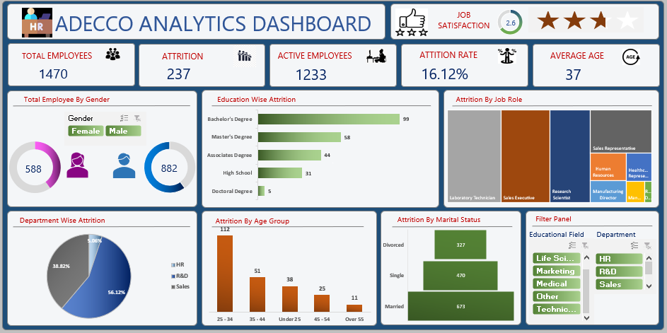

# Adecco Employee Attrition Analytics

## Problem Statement
Adecco India is facing **rising employee turnover**, particularly among junior sales employees, leading to higher recruitment costs, onboarding overhead, and productivity loss. This project analyzes HR data to **identify the main drivers of attrition** across departments, demographics, and satisfaction levels, with the goal of guiding targeted retention strategies and improving employee engagement.

---

## Analysis Done
- Used a **synthetic HR analytics dataset** (1,470 employees, 35+ features) mirroring a mid-sized organization’s workforce structure.
- Focused on the target variable **`Attrition` (Yes/No)** and key feature groups:
  - Demographics: **Age, Gender, MaritalStatus, DistanceFromHome**
  - Job details: **Department, JobRole, JobLevel, YearsAtCompany, BusinessTravel**
  - Compensation: **MonthlyIncome, HourlyRate, DailyRate, PercentSalaryHike**
  - Satisfaction: **JobSatisfaction, EnvironmentSatisfaction, WorkLifeBalance, RelationshipSatisfaction**
  - Career history: **TotalWorkingYears, NumCompaniesWorked, YearsSinceLastPromotion**
- Data preparation in Excel:
  - Removed non-informative constant fields (`EmployeeCount`, `StandardHours`, `Over18`).
  - Checked for duplicates and standardized categorical values (e.g., department names, attrition labels).
  - Validated ranges and corrected inconsistent entries where needed.
- Exploratory analysis using Excel:
  - Calculated **overall attrition rate** and total leavers using `COUNTIF` and related formulas.
  - Used **PivotTables** to compare attrition by **Department, JobRole, Age Group, Gender, Education, Overtime**.
  - Profiled leavers vs. stayers in terms of **tenure, income, satisfaction scores, commute distance**.
  - Used `CORREL` and visual charts to explore relationships between attrition and key drivers (e.g., satisfaction, overtime, distance).
  - Built scatter plots and trendlines for **Age vs. JobSatisfaction**, **WorkLifeBalance vs. Performance**, etc.
  - Segmented attrition by factors like **marital status, training, stock options** to reveal nuanced risk patterns.

---

## Dashboard Overview
> To use the dashboard, open `Solution.xlsx` and go to the **“Dashboard”** sheet. All interactivity is available on this tab.

The Excel dashboard consolidates the analysis into an interactive decision-support tool:

- **Key metrics:**
  - Overall attrition rate: **16.12%**
  - Total exits: **237**
  - Active headcount: **1,233**
  - Average tenure of leavers: **5.13 years**
- **Visual breakdowns:**
  - Attrition by **Department**, highlighting high-risk areas like Sales.
  - Attrition by **Age group, Gender, and Education**, surfacing higher turnover among younger employees and specific demographics.
  - Impact of **Overtime** and **JobSatisfaction** on attrition, showing where burnout and low engagement coincide.
- **Interactivity:**
  - Slicers for **Attrition, Department, Age, Gender, Education** enable focused, real-time filtering.
  - Callout tiles summarize top risk segments and highlight insights (e.g., junior sales roles with low satisfaction).
- Designed for **HR and leadership teams** to track attrition, understand its root causes, and evaluate the impact of retention initiatives over time.

---

## Recommendations
- **Prioritize at-risk groups:** Focus on junior employees in Sales and other high-attrition departments for mentoring, coaching, and role clarity.
- **Address satisfaction drivers:** Improve **JobSatisfaction, EnvironmentSatisfaction, and WorkLifeBalance** through workload balancing, flexible policies, and manager training.
- **Review compensation and growth:** Align **MonthlyIncome, promotion frequency, and development opportunities** with expectations—especially for high-performing but under-rewarded employees.
- **Target long-commute employees:** Consider hybrid options or transfers for employees with high **DistanceFromHome**, where feasible.
- **Monitor attrition KPIs regularly:** Use the dashboard in monthly HR reviews to track trends, refine interventions, and measure retention outcomes.

---

**Author:** `Kshitij Saini`  
**LinkedIn:** [Kshitij Saini](https://www.linkedin.com/in/kshitijsaini-b950b7299?utm_source=share_via&utm_content=profile&utm_medium=member_android)
